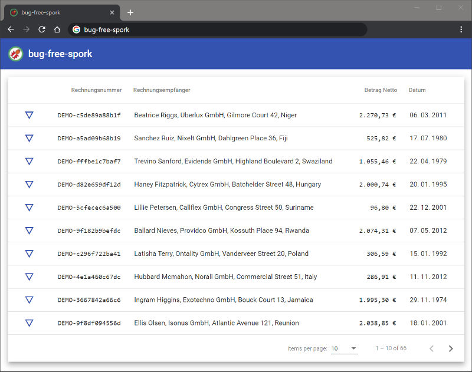

# bug-free-spork

See your `Rechnung`, matching `Rechnungposition` and their `Lieferstatus` with ease!

> I am forever greatful for GitHub's amazing random project name generator

— Jan, 2020

*Screenshot of what you see when bug-free-spork is up and ready for you.*

## Installing / Getting started

There are multiple ways to get bug-free-spork up and running:

### container

* pull image with: `docker pull docker.pkg.github.com/jan-ka/bug-free-spork/bug-free-spork:latest`
* run container with: `docker run --name bug-free-spork -d -p 3000:80 bug-free-spork:latest`
* Point your browser at: `http://localhost:3000`
* *Enjoy bug-free-spork*

### hosted

* Download Release Package
* Unpack into your favorite Web Server's Public Folder
* Point your browser to your Web Servers URL
* *Enjoy bug-free-spork!*

## Developing

This project was generated with [Angular CLI](https://github.com/angular/angular-cli) version 8.3.25.

Prepare your workspace with `nvm use` to setup node & npm; then run `npm install` to retrieve all dependencies.

### Development server

Run `ng serve` for a dev server. Navigate to `http://localhost:4200/`. The app will automatically reload if you change any of the source files.

### Build

Run `ng build` to build the project. The build artifacts will be stored in the `dist/` directory. Use the `--prod` flag for a production build.

You can use `npm run build` to create a production build.

### Running unit tests

Run `ng test` to execute the unit tests via [Karma](https://karma-runner.github.io).

### Running end-to-end tests

Run `ng e2e` to execute the end-to-end tests via [Protractor](http://www.protractortest.org/).

## Further help

Check out our [Wiki](https://github.com/Jan-Ka/bug-free-spork/wiki) with Information and Deliberations about this projects implementation.
Click the "Wiki" Button beneath the Repositories Header or use this link: https://github.com/Jan-Ka/bug-free-spork/wiki
